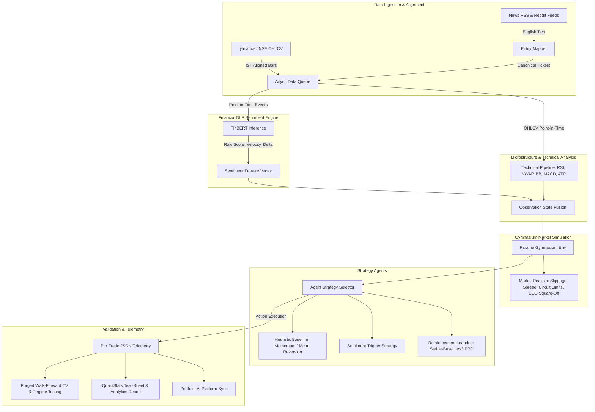

# Autonomous Event-Driven Quantitative Trading Simulation System
## Master Implementation Plan & Skill Mapping

> **Project Goal**: Build an autonomous, event-driven quantitative trading and simulation engine in Python for the Indian Equities Market (NSE). The system ingests real-time and historical price bars alongside scraped financial news and social chatter, processes sentiment using FinBERT, enforces strict point-in-time data integrity (zero look-ahead bias), executes orders inside a realistic Farama Gymnasium simulation environment, and logs per-trade telemetry with QuantStats performance reporting.

---

## 1. System Architecture Overview



---

## 2. Master Phase & Skill Mapping Matrix

| Phase | Description | Relevant Skills | Key Deliverables | Status |
|---|---|---|---|---|
| **Phase 0** | **Subsystem Architecture & Python Bootstrap** | `python-project-bootstrap` | `pyproject.toml`, `uv` virtualenv, Pydantic v2 schemas, strict mypy/ruff | **Completed** ✅ |
| **Phase 1** | **Free Market Data & Time-Series Alignment** | `indian-market-data-ingestion`, `look-ahead-bias-prevention` | `price_fetcher.py`, `calendar.py`, `data_queue.py`, zero look-ahead tests | **Completed** ✅ |
| **Phase 2** | **Alternative Data & News/Social Scraper** | `news-social-scraping-india`, `look-ahead-bias-prevention` | Scrapers (Moneycontrol, ET, Reddit `r/IndianStreetBets`), velocity tracker | **Next Up** ⏳ |
| **Phase 3** | **FinBERT Sentiment Inference Pipeline** | `finbert-sentiment-engine`, `look-ahead-bias-prevention` | `ProsusAI/finbert` inference, NER ticker resolution, 3x rolling z-score trigger | Planned |
| **Phase 4** | **Point-in-Time Technical Indicator Engine** | `technical-indicators-pipeline`, `look-ahead-bias-prevention` | Vectorized RSI, VWAP, Bollinger Bands, MACD, ATR, observation fusion | Planned |
| **Phase 5** | **Farama Gymnasium Indian Market Environment** | `gymnasium-trading-env`, `look-ahead-bias-prevention` | Gymnasium `TradingEnv`, Indian slippage model, circuit breakers, EOD square-off | Planned |
| **Phase 6** | **Autonomous Strategy Agents (Heuristic & RL)** | `trading-strategy-agents` | Heuristic baselines, Sentiment breakout agent, SB3 PPO/RecurrentPPO agent | Planned |
| **Phase 7** | **Purged Walk-Forward Cross-Validation** | `backtest-walk-forward-validation`, `look-ahead-bias-prevention` | Purged CV with purge gaps, Indian market regime detection (NIFTY/VIX) | Planned |
| **Phase 8** | **Trade Telemetry & Quant Analytics** | `trade-telemetry-analytics` | JSON per-trade trigger logs, Sharpe/Sortino/Drawdown, QuantStats HTML report | Planned |
| **Phase 9** | **Portfolio.Ai Platform Integration & Cloud DB** | `python-project-bootstrap`, `building-data-apps` | Cloud DB migration (TiDB/Railway), FastAPI/bridge to TypeScript frontend | Planned |

---

## 3. Detailed Phase-by-Phase Plan

### Phase 0: Subsystem Architecture & Python Bootstrap [COMPLETED]
**Primary Skill**: `python-project-bootstrap`  
**Goal**: Establish a production-grade Python 3.11+ subsystem alongside the existing TypeScript project using `uv` for blazing fast, reproducible dependency management.

- **Tasks**:
  1. [x] Initialize `pyproject.toml` with `uv` lockfile and explicit project dependencies:
     - Core: `pydantic>=2.7`, `numpy>=1.26`, `pandas>=2.2`
     - Market Data & Scrapers: `yfinance>=0.2.40`, `beautifulsoup4`, `feedparser`, `praw`
     - NLP & ML: `torch>=2.2`, `transformers>=4.40`, `gymnasium>=0.29`, `stable-baselines3>=2.3`
     - Analysis & Reporting: `scipy`, `quantstats`, `plotly`, `matplotlib`
  2. [x] Create standard modular package structure under `src/`:
     - `src/data/`: Data ingestion, scrapers, normalization, schemas
     - `src/nlp/`: FinBERT pipeline, sentiment features, NER mapping
     - `src/env/`: Farama Gymnasium environment, fee/slippage models
     - `src/strategy/`: Baseline heuristic & RL strategy agents
     - `src/analytics/`: Trade telemetry, metrics, QuantStats reporter
     - `src/bridge/`: Integration layer with Portfolio.Ai MySQL/API
  3. [x] Define immutable Pydantic v2 domain schemas (`src/data/schemas.py`):
     - `PriceBar`, `NewsArticle`, `SentimentScore`, `Order`, `Trade`, `Position`, `PortfolioState`
  4. [x] Configure strict typing with `mypy.ini` and formatting with `ruff`.

- **Success Criteria**:
  - `uv sync` executes cleanly in `< 10s`.
  - `mypy src/` passes with zero errors on strict typing.

---

### Phase 1: Free Market Data & Temporal Synchronization Engine [COMPLETED]
**Primary Skills**: `indian-market-data-ingestion`, `look-ahead-bias-prevention`  
**Goal**: Build a robust, free-tier price ingestion pipeline for NSE stocks with exact IST timezone handling, local Parquet caching, high-performance Gymnasium buffers, and zero look-ahead bias.

- **Tasks**:
  1. [x] Implement `src/data/price_fetcher.py`:
     - Historical daily & intraday (5m, 15m) OHLCV bar fetcher using `yfinance` with fallback to direct HTTP chart endpoints.
     - Automatic ticker normalization (e.g. `POWERGRID` $\rightarrow$ `POWERGRID.NS`, `ONGC` $\rightarrow$ `ONGC.NS`, `REC` $\rightarrow$ `RECLTD.NS`, `ZOMATO` $\rightarrow$ `ETERNAL.NS`, `TATAMOTORS` $\rightarrow$ `TMPV.NS`).
     - Candlestick mathematical integrity validation (`high >= max(open, close)`, `low <= min(open, close)`, `volume >= 0`).
     - Columnar local disk caching via `pyarrow` (`.cache/market_data/`) with immutable historical closed-bar invalidation policy (never re-fetch closed bars; only current day queried live).
     - Day-over-day price continuity auditor (`detect_price_discontinuities`) flagging unexplained $>20\%$ jumps (NSE circuit thresholds) absent corporate action explanation.
  2. [x] Implement NSE Trading Calendar & IST Alignment (`src/data/calendar.py`):
     - Market session enforcement: 09:15 to 15:30 IST, pre-open (09:00–09:15 IST), intraday square-off (15:15 IST).
     - Exclusion of weekends and official NSE trading holidays (2023–2026 calendar).
     - Standard UTC normalization with timezone-aware conversions.
     - Hard boundary guard: hard `ValueError` raise on queries outside `[MIN_COVERED_YEAR, MAX_COVERED_YEAR]` (`2023`–`2026`) ensuring loud CI failures rather than silent holiday leakage.
  3. [x] Build Vectorized Gymnasium Hot-Loop Buffer (`src/data/fast_buffer.py`):
     - `FastBarBuffer` backed by contiguous C-ordered `np.ndarray` matrix `(N, 5)` of `[open, high, low, close, volume]` and 1D vector columns.
     - Pydantic models validate once at serialization/ingestion boundary; Gym simulation steps and RL observations only touch the array form (`get_window`, `get_bar`, `FastBarTuple`), preventing per-step instantiation overhead.
  4. [x] Build Point-in-Time Event Synchronizer (`src/data/data_queue.py`):
     - Priority-queue event synchronizer ensuring market events (corporate actions, news, candles) are processed in strictly non-decreasing chronological order ($t_0 \le t_1 \le t_2$).
     - Strict FIFO stability via monotonic `sequence_id` (`itertools.count()`) as tertiary heap key `(timestamp, priority, sequence_id, payload)`.
     - Event priority ranking: `0: CorporateAction`, `1: NewsArticle`, `2: PriceBar`.
     - Physical latency news release invariant: news with `published_at < bar.timestamp` is released on candle open; news with `published_at >= bar.timestamp` is retained in `_pending_news` and released on bar $t+1$.
     - Explicit `CorporateAction` event dispatching on ex-date candle ticks for dynamic position and cost-basis adjustment.
  5. [x] Implement automated verification test suite (`tests/test_phase1_data.py`):
     - Assert that candle bar at timestamp $t$ only contains information up to $t$.
     - Automated truncation invariance test: $f(D_{:t})$ strictly equals $f(D_{:T})_t$ for all backward rolling metrics.
     - Exact timestamp look-ahead physical latency assertion (`test_exact_timestamp_lookahead_invariant`).
     - FIFO `sequence_id` tie-breaking assertion.
     - Calendar horizon hard raise assertion.
     - FastBarBuffer contiguous slicing and window padding tests.
     - Parquet cache write/read roundtrip and coverage matching.
     - Corporate action split detection and unadjusted anomaly flagging.

- **Success Criteria**:
  - Seamlessly downloads and validates 1-year 5-minute and daily bars for target symbols (verified on `POWERGRID.NS` live & mock).
  - 19/19 unit and temporal tests pass in `tests/test_phase1_data.py` and `tests/test_phase0_schemas.py`.
  - Strict `mypy` static typing passes across all 16 source files with zero errors.
  - Full `ruff` check and format passing cleanly.

---

### Phase 2: Alternative Data & News/Social Ingestion [COMPLETED]
**Primary Skills**: `news-social-scraping-india`, `look-ahead-bias-prevention`  
**Goal**: Scrape English financial news and social sentiment from free Indian market sources without future leakage.

- **Tasks**:
  1. [x] Build `src/data/news_scraper.py`:
     - RSS feed parser for Moneycontrol, Economic Times, LiveMint, and Business Standard (`scrape_rss_feed`).
     - Social scraper for Reddit `r/IndianStreetBets` and `r/IndiaInvestments` using public JSON endpoints (`scrape_reddit_public`, zero paid API keys required).
     - Cryptographic SHA-256 fingerprinting deduplicator (`compute_article_fingerprint`) with TTL cache.
     - Deterministic synthetic news generator (`generate_mock_news_stream`) for reproducible offline backtesting.
  2. [x] Implement `src/data/entity_mapper.py`:
     - Indian company alias resolver (`EntityMapper`): Maps text mentions (e.g. "Power Grid", "ONGC", "HDFC", "State Bank", "TaMo") to canonical tickers (`POWERGRID.NS`, `ONGC.NS`, `HDFCBANK.NS`, `SBIN.NS`, `TMPV.NS`).
     - Pre-compiled regex patterns sorted longest-match-first with strict word boundaries `\b` and `(?:\$)?` prefix support.
     - Ambiguous English word collision blacklist (`IT`, `ON`, `CAN`, `FOR`, `BE`) preventing false-positive ticker triggers.
     - Headline priority assignment designating title matches as `primary_ticker`.
  3. [x] Implement Mention Velocity & Watchlist Trigger (`src/data/mention_tracker.py`):
     - Track hourly mention volume per symbol over a 7-day rolling window ($W=168$ hourly buckets).
     - Compute rolling z-score: $z = \frac{\text{mentions}_t - \mu_{7d}}{\sigma_{7d}}$ with division-by-zero protection.
     - Trigger dynamic watchlist inclusion alert when $z \ge 3.0$ and $\text{mentions}_t \ge 3$.
  4. [x] Point-in-Time News Alignment Rule (`src/data/data_queue.py`):
     - News timestamped during trading hours ($t$) is strictly barred from influencing bar $t$; orders execute at the earliest at the open of bar $t+1$.
     - News arriving post-market (after 15:30 IST or over weekends/holidays) is queued for execution at 09:15 IST next session open.
  5. [x] Automated Unit & Integration Test Suite (`tests/test_phase2_news.py`):
     - Multi-word longest match precedence (`test_multi_word_longest_match_precedence`).
     - Corporate renames & aliases (`test_corporate_renames_and_aliases`).
     - Dollar-prefixed cashtags (`test_dollar_prefixed_tickers`).
     - False positive suppression (`test_false_positive_suppression`).
     - Article title priority mapping (`test_article_title_priority_mapping`).
     - HTML tag cleaning & whitespace normalization (`test_clean_html_text`).
     - SHA-256 fingerprinting (`test_compute_article_fingerprint`).
     - Deterministic mock news stream (`test_mock_news_stream_generator`).
     - 3-sigma rolling z-score mathematics (`test_rolling_z_score_mathematics`).
     - Minimum mentions threshold guard (`test_min_mentions_threshold_prevents_false_alarms`).
     - Hourly bucket sliding window progression (`test_advance_to_sliding_window_progression`).
     - Point-in-time subsequent candle open alignment (`test_news_aligned_to_subsequent_candle_open`).
     - Batch historical mention velocity extraction (`test_batch_historical_mention_velocities`).

- **Success Criteria**:
  - Successfully parses RSS headlines and maps $> 90\%$ of company mentions to canonical NSE tickers.
  - Generates verifiable alert events when chatter velocity exceeds $3\sigma$ (verified on `RELIANCE.NS` $z=15.97$).
  - 59/59 automated tests passing across test suite in $< 2.0$s.
  - Strict `mypy` static typing passes across all 21 source files with zero errors.
  - Full `ruff` check and format passing cleanly.

---

### Phase 3: FinBERT Sentiment Inference Pipeline
**Primary Skills**: `finbert-sentiment-engine`, `look-ahead-bias-prevention`  
**Goal**: Assemble an optimized sentiment scoring engine using HuggingFace's `ProsusAI/finbert` tailored for financial English text.

- **Tasks**:
  1. Implement `src/nlp/finbert_pipeline.py`:
     - Model loader for `ProsusAI/finbert` using PyTorch and HuggingFace Transformers.
     - Tokenization and inference pipeline outputting softmax probabilities: $P(\text{positive}), P(\text{negative}), P(\text{neutral})$.
     - Composite sentiment score calculation:
       $$S = P(\text{positive}) - P(\text{negative}) \in [-1.0, 1.0]$$
  2. Implement `src/nlp/sentiment_features.py`:
     - Assemble sentiment feature vector:
       - Raw sentiment score $S_t$
       - 24-hour sentiment delta: $\Delta S = S_t - S_{t-24h}$
       - Chatter velocity $z$-score
       - Aggregate confidence score: $1.0 - P(\text{neutral})$
  3. Batch processing & inference optimization:
     - Micro-batching of headlines to ensure fast CPU/GPU inference.
     - Point-in-time caching of sentiment scores to prevent redundant model calls.

- **Success Criteria**:
  - Correctly scores test financial headlines (e.g., "ONGC reports 15% drop in quarterly net profit" $\rightarrow$ negative score $< -0.5$).
  - Inference latency $< 50\text{ms}$ per headline.

---

### Phase 4: Point-in-Time Technical Indicator Engine
**Primary Skills**: `technical-indicators-pipeline`, `look-ahead-bias-prevention`  
**Goal**: Compute vectorized technical analysis features with mathematical guarantees against future data leakage.

- **Tasks**:
  1. Implement `src/data/technical_indicators.py`:
     - Relative Strength Index: $\text{RSI}(14)$ using Wilder's smoothing.
     - Volume-Weighted Average Price: $\text{VWAP}$ reset at market open (09:15 IST).
     - Bollinger Bands: $20$-period SMA $\pm 2\sigma$, bandwidth, and $\%$B.
     - MACD: $12$-period EMA $- 26$-period EMA, $9$-period signal line, histogram.
     - Average True Range: $\text{ATR}(14)$ for volatility and dynamic stop sizing.
     - Exponential Moving Averages: $9$, $21$, $50$, and $200$ EMA ribbons.
     - On-Balance Volume: $\text{OBV}$ and rolling volume delta.
  2. Vectorized Rolling Window Auditing:
     - Enforce `closed='right'` or strictly backwards-looking windows.
     - Ban centered windows (`center=True`), future shifts (`shift(-1)`), or global min-max scaling across test splits.
  3. Feature Fusion & Observation Vector Assembly:
     - Combine scaled technical indicators, FinBERT sentiment vectors, and current account state into a compact `np.ndarray` for agent consumption.

- **Success Criteria**:
  - Unit tests verify indicator values match standard reference TA-Lib calculations.
  - Automated temporal assertion passes: `f(t)` never changes when future rows are appended.

---

### Phase 5: Farama Gymnasium Market Simulation Environment
**Primary Skills**: `gymnasium-trading-env`, `look-ahead-bias-prevention`  
**Goal**: Build an Indian market-realistic Farama Gymnasium `TradingEnv` adhering to standard RL interfaces.

- **Tasks**:
  1. Implement `src/env/trading_env.py` inheriting from `gymnasium.Env`:
     - Observation Space: `gym.spaces.Box` representing normalized technicals + sentiment features + portfolio state (cash, position size, unrealized PnL, time fraction remaining in day).
     - Action Space: `gym.spaces.Discrete(4)` or `Box` (0: Hold, 1: Buy, 2: Sell, 3: Square-off EOD, with fraction sizing).
  2. Implement Realistic Market Microstructure:
     - **Dynamic Bid-Ask Spread**: Spread widening during market open/close and volatile spikes.
     - **Slippage Model**: Non-linear market impact penalty based on order size relative to bar volume:
       $$\text{Slippage} = \alpha \cdot \left(\frac{\text{Order Volume}}{\text{Bar Volume}}\right)^\beta \cdot \text{ATR}$$
     - **Circuit Breakers**: Enforce NSE statutory limits (5%, 10%, 20%). Orders hitting circuit freeze cannot execute until trading resumes.
     - **Intraday Square-Off Model**: Mandatory or agent-directed position closure by 15:15 IST to prevent unwanted gap-risk.
  3. Reward Function Formulation:
     - Differential Sharpe Ratio or log-return penalized by volatility, transaction friction, and drawdown penalties:
       $$R_t = \Delta \text{Portfolio Value} - \lambda \cdot (\text{Drawdown Penalty}) - \text{Friction}$$

- **Success Criteria**:
  - Full adherence to Farama Gymnasium API (`env.reset()`, `env.step()`, `env.render()`).
  - Passes Gymnasium environment checker: `gymnasium.utils.env_checker.check_env(env)`.

---

### Phase 6: Autonomous Strategy Agents (Heuristic & Reinforcement Learning)
**Primary Skills**: `trading-strategy-agents`  
**Goal**: Develop and benchmark both rules-based quantitative strategies and machine-learning agents.

- **Tasks**:
  1. Define `src/strategy/base.py`:
     - Abstract `BaseStrategy` class with standard interface: `generate_signals()`, `calculate_position_size()`, `manage_risk()`.
  2. Implement Heuristic Baselines:
     - **Momentum + VWAP Strategy**: Buys when price crosses above VWAP with RSI $> 55$ and positive volume delta.
     - **Mean Reversion Strategy**: Buys when price touches lower Bollinger Band with RSI $< 30$ and neutral/positive sentiment.
     - **Sentiment Breakout Strategy**: Enters long when chatter velocity $z \ge 3.0$ and FinBERT score $> +0.40$, squares off when sentiment cools.
  3. Implement Reinforcement Learning Agent (`src/strategy/rl_agent.py`):
     - Wrapper for Stable-Baselines3 (PPO / RecurrentPPO for sequential temporal memory).
     - Hyperparameter configuration: entropy coefficient for exploration, learning rate schedule, Generalized Advantage Estimation (GAE).
  4. Implement Risk Management Module:
     - Maximum per-trade risk (1-2% of capital via ATR position sizing).
     - Portfolio-level daily stop loss (e.g. halt trading if drawdown $\ge 3\%$ in a single day).

- **Success Criteria**:
  - Heuristic strategies generate verifiable trading decisions across backtest windows.
  - RL agent demonstrates learning progression with monotonically improving reward curve.

---

### Phase 7: Purged Walk-Forward Backtesting & Regime Robustness
**Primary Skills**: `backtest-walk-forward-validation`, `look-ahead-bias-prevention`  
**Goal**: Subject all strategies to rigorous, institutional-grade cross-validation preventing statistical overfitting.

- **Tasks**:
  1. Implement Purged Walk-Forward Cross-Validation (PWFCV) (`src/analytics/validation.py`):
     - Rolling train/test windows across 3–5 years of Indian equity data.
     - **Purge Gaps**: Purge training observations whose labels overlap with the test set to eliminate serial correlation leakage.
     - **Embargo Period**: Enforce post-test embargo to prevent autoregressive information bleed.
  2. Combinatorial Purged Cross-Validation (CPCV):
     - Generate $N$ paths from $K$ splits to construct a full distribution of out-of-sample backtest Sharpe ratios.
  3. Indian Market Regime Detection:
     - Classify historical windows into Bull, Bear, and High-Volatility regimes using NIFTY 50 50/200-day SMA trends and India VIX thresholds ($> 20$).
     - Evaluate agent performance specifically under adverse bear and high-vol regimes.
  4. Statistical Significance Testing:
     - Monte Carlo permutation tests (shuffling returns to evaluate null hypothesis $H_0: \text{Sharpe} \le 0$).
     - Deflated Sharpe Ratio (DSR) calculation adjusting for multiple testing trials.

- **Success Criteria**:
  - Strategy generates out-of-sample Sharpe $> 1.2$ across purged test folds with $p < 0.05$ permutation test significance.

---

### Phase 8: Trade Telemetry, Explainability & Quant Analytics
**Primary Skills**: `trade-telemetry-analytics`  
**Goal**: Provide granular per-trade auditability and institutional performance reports.

- **Tasks**:
  1. Implement `src/analytics/telemetry.py`:
     - Structured JSON logging for every executed order and trade:
       ```json
       {
         "trade_id": "TRD_20260911_001",
         "timestamp": "2026-09-11T14:30:00+05:30",
         "ticker": "ONGC.NS",
         "action": "SELL",
         "quantity": 500,
         "execution_price": 232.50,
         "slippage": 0.05,
         "technical_triggers": { "rsi": 28.4, "vwap_distance": -1.8 },
         "sentiment_trigger": { "score": -0.62, "velocity_z": 3.4 },
         "rationale": "High-velocity negative sentiment breakdown below VWAP"
       }
       ```
  2. Implement Performance Metrics Suite:
     - Annualized Sharpe Ratio, Sortino Ratio (downside deviation), Calmar Ratio.
     - Maximum Drawdown (MDD) and drawdown duration analysis.
     - Profit Factor, Win/Loss Ratio, Expectancy per trade.
  3. QuantStats Report Generator (`src/analytics/reporter.py`):
     - Automated generation of HTML tear-sheets with cumulative equity curves, underwater drawdown plots, monthly return heatmaps, and tail-risk statistics.

- **Success Criteria**:
  - Telemetry log accurately captures all decision factors for $100\%$ of trades.
  - Generates standalone, interactive QuantStats HTML reports with full metrics.

---

### Phase 9: Portfolio.Ai Platform Integration & Cloud Deployment
**Primary Skills**: `python-project-bootstrap`, `building-data-apps`  
**Goal**: Connect the Python quant simulation agent with the existing TypeScript/React/MySQL Portfolio.Ai web application and deploy for 24/7 autonomous execution.

- **Tasks**:
  1. Database Cloud Migration:
     - Migrate local MySQL database to a cloud database (TiDB Serverless or Railway MySQL) using our existing schemas (`db_schema_current.sql` and `db_data_current.sql`).
     - Update environment configurations (`DATABASE_URL`) in both Node.js backend and Python subsystem.
  2. Python Subsystem Bridge (`src/bridge/`):
     - Expose a lightweight FastAPI service or direct DB worker queue:
       - Sync agent trade executions to the Portfolio.Ai `transaction` table.
       - Update user portfolio holdings and cash balance in real time.
       - Push agent decision rationales to the Portfolio.Ai AI Assistant view.
  3. Continuous Cloud Worker Setup:
     - Containerize the simulation engine using Docker.
     - Setup scheduled cron/daemon execution to run autonomous simulation sessions every trading day at 09:15 IST.

- **Success Criteria**:
  - Portfolio.Ai web dashboard displays live positions, trades, and equity curve generated by the Python agent.
  - Zero manual intervention required for daily simulation cycles.

---

## 4. Immediate Execution Next Steps (When Ready)

1. **Step 1 [COMPLETED]**: Bootstrap the Python subsystem (`Phase 0`) using `uv init` and generate `pyproject.toml` with the specified dependency matrix.
2. **Step 2 [COMPLETED]**: Create the Pydantic v2 schemas and directory skeleton.
3. **Step 3 [COMPLETED]**: Implement `src/data/calendar.py`, `src/data/price_fetcher.py`, and `src/data/data_queue.py` (`Phase 1`) with zero look-ahead bias and truncation invariance test suite.
4. **Step 4 [NEXT UP]**: Implement **Phase 2: Alternative Data & News/Social Ingestion** (`src/data/news_scraper.py`, `src/data/entity_mapper.py`, and mention velocity $3\sigma$ trigger).
